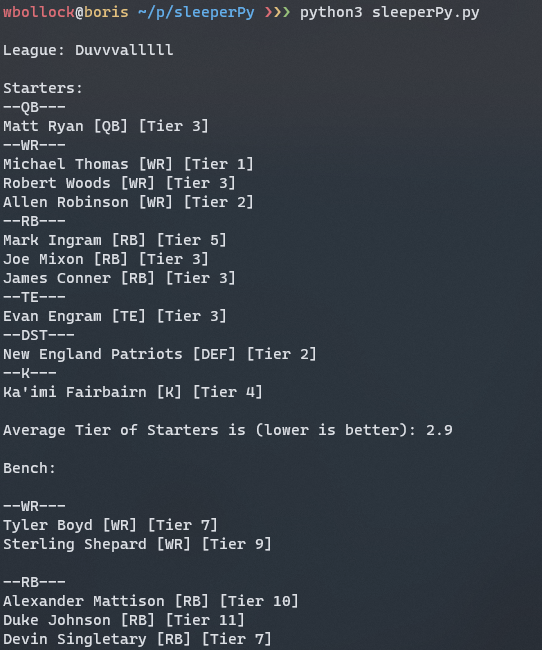
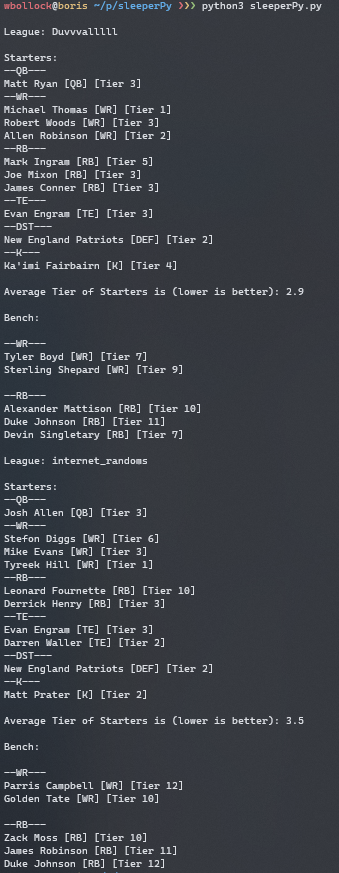

# sleeperPy

A program to allow users to easily parse their [Sleeper](https://sleeper.app/) Fantasy Football team using [Boris Chen's](http://www.borischen.co/) tiers (accumulated from all FantasyPros.com experts).



Try it on my [personal website](https://wboll.dev/sleeperPy/).

Only Sleeper Fantasy Football is supported.

## Features

* Utilizes the Sleeper APISupport for multiple leagues. Simply enter your Sleeper username.
* Multiple scoring types accounted for, standard, 0.5 PPR and PPR. 
* Shows the current tier of each player, dividing starters and bench.

## Usage

### Command Line

```
python3 sleeperPy.py <username>
```

Then find your tiers:

```
cat tiers/tiers_$username.txt
```

### Web

Requirements:

 * php 7+

```
git clone https://github.com/wbollock/sleeperPy.git
```

Make sure your web server has permissions for the `tiers` folder, `sleeperPy.py`, and `index.php`.


### Multiple League Support



### Considerations

Team formatting is not great right now. Code is pretty horrible too, lots of copying and pasting. Definitely not clean code. But it works.